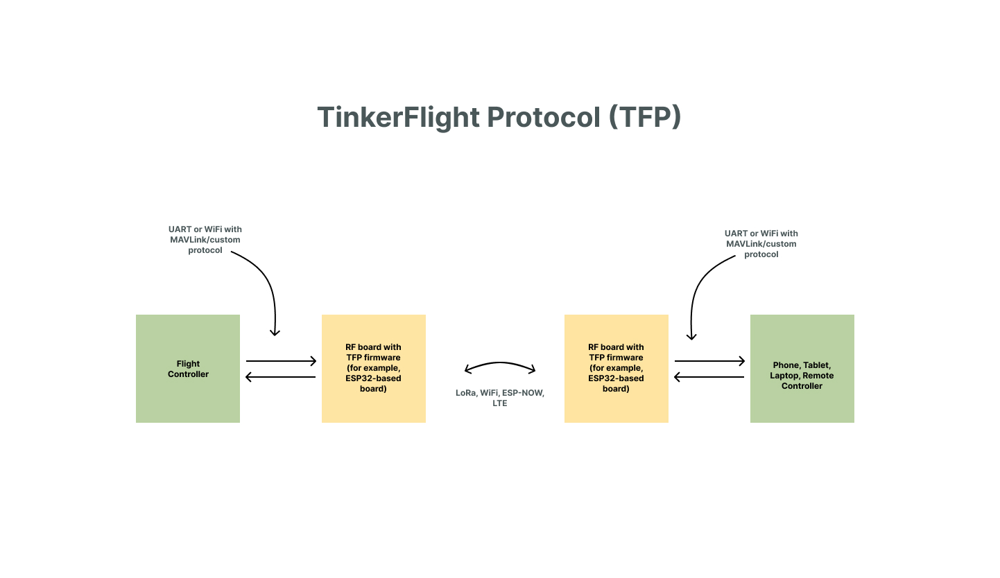

**TFP (TinkerFlight Protocol)** is a lightweight, easy-to-use protocol for drones, aircraft, and remote vehicles. It is compatible with LoRa, Wi-Fi, ESP-NOW, and other network protocols. With TFP, you can send any type of data and receive exactly the same data on the other end. For example, you can transmit MAVLink commands, CRSF data, create your own custom protocol, or use the built-in TFP commands.

---

### Main Features

* **Network-agnostic** – works with LoRa, Wi-Fi, ESP-NOW, ESP-NOW Long Range, LTE, and more
* **Built-in encryption**
* **Lightweight and efficient**
* **Supports any protocol** – MAVLink, CRSF, custom protocols
* **Flexible** – communicate between two ESP32-based boards, or between an ESP32 and a phone, tablet, or laptop
* **Custom protocol friendly** – easy to implement your own communication format

---

### How TFP Works

1. **Prepare two ESP32-based boards** (referred to as RF boards).

    * The first RF board (mounted on a drone, aircraft, or vehicle) can be connected to a flight controller via UART to forward MAVLink messages, or it can be used as a flight controller itself.
    * The second RF board can connect to a phone, tablet, laptop over Wi-Fi, or to a remote controller (e.g., RadioMaster) via UART.

2. **Configure settings** in the `tfp_config.h` file, including the network protocol, encryption key, and other options (refer to comments in the file for guidance).

3. **Upload the firmware** to both RF boards. The same firmware is used for both transmitter and receiver—no need for different versions.

4. **Power up both RF boards.**

5. **Connect to each board's Wi-Fi network** from two different devices (e.g., a phone and a laptop).

6. **Open [http://tfp.local](http://tfp.local)** in a browser on each device. Select the protocol you'd like to use for communication between the two RF boards (e.g., between a drone and a laptop), and send a test message to verify the setup.

---

### Documentation

More information and documentation about the TinkerFlight Protocol and TinkerFlight Controller can be found at [tinkerflight.com](https://tinkerflight.com).

---

### License

TFP is free for use in both private and commercial projects, **except** when selling hardware with pre-installed TFP firmware (e.g., RF modules or boards).
If you plan to sell hardware preloaded with TFP, a small fee of **\$0.50 per unit** applies.
Please contact us at hey@tinkerflight.com for licensing details. These contributions help us support a full-time core team developing the TinkerFlight Protocol and TinkerFlight Controller, aiming to deliver a near out-of-the-box experience.
